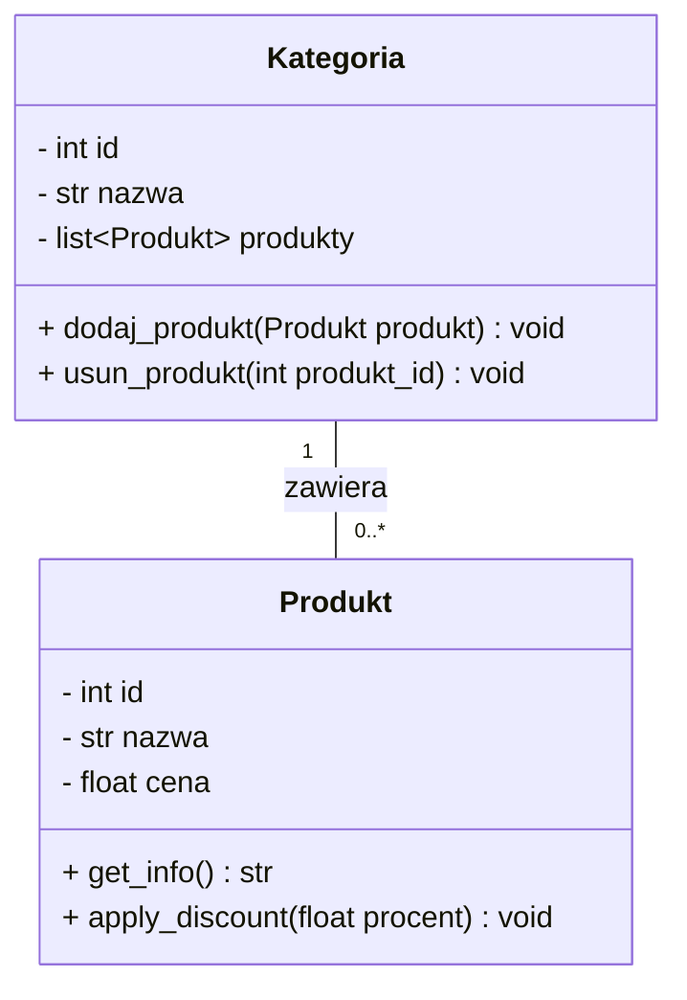

```mermaid
classDiagram
    class Produkt {
        - int id
        - str nazwa
        - float cena
        + get_info() str
        + apply_discount(float procent) void
    }

    class Kategoria {
        - int id
        - str nazwa
        - list~Produkt~ produkty
        + dodaj_produkt(Produkt produkt) void
        + usun_produkt(int produkt_id) void
    }

    Kategoria "1" -- "0..*" Produkt : zawiera
```